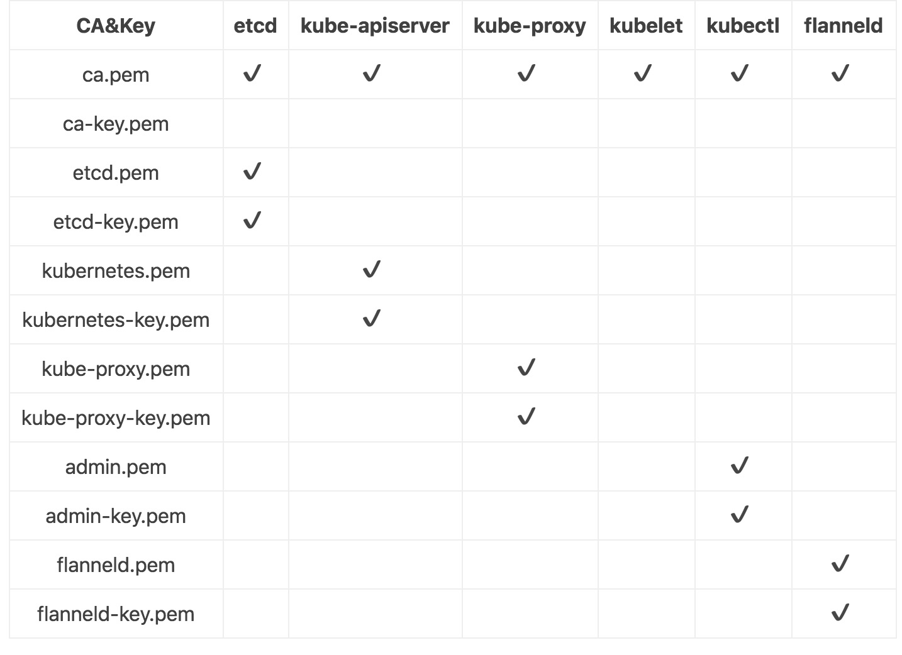

<!--
 * @Author: cnak47
 * @Date: 2018-12-17 10:21:52
 * @LastEditors: cnak47
 * @LastEditTime: 2019-08-14 17:48:28
 * @Description: 
 -->

# 02.集群安全设置

Kubernetes 的安全设置有两种：

- 基于 Certificate Authority(CA)签名的双向数字证书认证
- 基于 HTTP BASE/TOKEN 的认证
- 其中以 CA 证书为安全设置的安全性最高。

## k8s 集群组件所需证书



## CA 证书和秘钥

kubernetes 系统各组件需要使用 x509 证书对通信进行加密和认证.
CA (Certificate Authority)是自签名的根证书，用来签名后续创建的其它证书.
我们使用 CloudFlare 的 PKI 工具集[cfssl](https://github.com/cloudflare/cfssl)创建所有证书.

Certificate types which are used inside Container Linux:

- client certificate:
  is used to authenticate client by server. For example etcdctl,etcd proxy,or docker clients
- server certificate:
  is used by server and verified by client for server identity. For example docker server or kube-apiserver
- peer certificate:
  is used by etcd cluster members as they communicate with each other in both ways

### 安装 cfssl 工具集

脚本: cert/cfssl-install.sh

### 创建根证书 (CA)

CA 证书是集群所有节点共享的，只需要创建一个 CA 证书，后续创建的所有证书都由它签名
脚本：cert/ca-all.sh

#### 创建配置文件

CA 配置文件用于配置根证书的使用场景 (profile) 和具体参数 (usage，过期时间、服务端认证、客户端认证、加密等)，后续在签名其它证书时需要指定特定场景。

```bash
# CA配置文件

cat > ca-config.json <<EOF
{
    "signing": {
        "default": {
            "expiry": "2540400h"
        },
        "profiles": {
            "server": {
                "expiry": "2540400h",
                "usages": [
                    "signing",
                    "key encipherment",
                    "server auth"
                ]
            },
            "client": {
                "expiry": "2540400h",
                "usages": [
                    "signing",
                    "key encipherment",
                    "client auth"
                ]
            },
            "peer": {
                "expiry": "2540400h",
                "usages": [
                    "signing",
                    "key encipherment",
                    "server auth",
                    "client auth"
                ]
            }
        }
    }
}
EOF
# 2540400h 是 golang time.Duration 的最大值 290y
# signing:表示该证书可用于签名其它证书,生成的 ca.pem 证书中 CA=TRUE
# server auth: 表示client可以用该证书对server 提供的证书进行验证
# client auth:表示server可以用该证书对client 提供的证书进行验证
```

#### 创建证书签名请求文件

```bash
cat > ca-csr.json <<EOF
{
  "CN": "kubernetes",
  "key": {
    "algo": "rsa",
    "size": 2048
  },
  "names": [
    {
      "C": "CN",
      "ST": "Beijing",
      "L": "Beijing",
      "O": "ANSHI",
      "OU": "K8S"
    }
  ]
}
EOF

```

- CN: Common Name kube-apiserver 从证书中提取该字段作为请求的用户名 (User Name)，浏览器使用该字段验证网站是否合法，一般写的是域名。非常重要
- C: Country,国家
- L: Locality,地区,城市
- O: Organization Name,组织名称,公司名称，kube-apiserver 从证书中提取该字段作为请求用户所属的组 (Group)
- OU: Organization Unit Name,组织单位名称,公司部门
- ST: State,州,省
- kube-apiserver 将提取 的 User Name,Group 作为 RBAC 授权的用户标识

#### 生成 CA 证书和私钥

脚本:cert/get-ca.sh

**==NOTE==**

Please keep ca-key.pem file in safe. This key allows to create any kind of certificates within your CA.
\*.csr files are not used in our example.

Don't put your ca-key.pem into a Container Linux Config, it is recommended to store it in safe place. This key allows to generate as much certificates as possible.

Keep key files in safe. Don't forget to set proper file permissions, i.e. chmod 0600 server-key.pem.

#### 分发证书文件

将生成的 CA 证书,秘钥文件,配置文件拷贝到所有节点的/etc/kubernetes/cert 目录下

脚本:cert/de-ca.sh

**==参考==**

各种 CA 证书类型：<https://github.com/kubernetes-incubator/apiserver-builder/blob/master/docs/concepts/auth.md>
