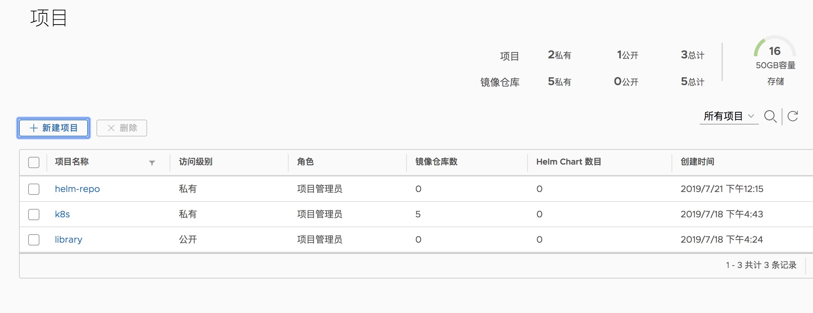

********# Helm 容器应用包管理工具

## 基本概念

- Chart:包含了创建一个 Kubernetes应用的必要信息
- Repository:Helm package存储仓库
- Release:是一个 chart及其配置的一个运行实例

## 准备
GitHub：https://github.com/helm/helm

官网：https://helm.sh/docs/using_helm/#quickstart-guide

### 下载images
1. helm/image/pull-tiller-gcr.sh 需要翻墙
2. helm/image/push-tiller-harbor.sh 上传到私有仓库
3. helm/image/pull-titler-harbor.sh

### helm 和tiller 相关证书

脚本:helm/get-helm-cert.sh

```bash
source /opt/k8s/bin/environment.sh
[ ! -d /opt/k8s/certs ] && mkdir -p /opt/k8s/certs
[ -d /opt/k8s/certs/helm ] && rm -rf /opt/k8s/certs/helm
mkdir -p /opt/k8s/certs/helm
cd /opt/k8s/certs/helm || exit
info "create  helm-csr.json ..... "
# helm 客户端证书
cat > helm-csr.json <<EOF
{
  "CN": "helm",
  "hosts": [],
  "key": {
    "algo": "rsa",
    "size": 2048
  },
  "names": [
    {
      "C": "CN",
      "ST": "Beijing",
      "L": "Beijing",
      "O": "ANSHI",
      "OU": "k8s"
    }
  ]
}
EOF
info "create certificate and private key ...."
cfssl gencert -ca=/etc/kubernetes/cert/ca.pem \
  -ca-key=/etc/kubernetes/cert/ca-key.pem  \
  -config=/etc/kubernetes/cert/ca-config.json  \
  -profile=peer helm-csr.json | cfssljson -bare helm

info "create tiller-csr.json ..... "
# tiller 服务端证书请求
cat > tiller-csr.json <<EOF
{
  "CN": "tiller",
  "hosts": [],
  "key": {
    "algo": "rsa",
    "size": 2048
  },
  "names": [
    {
        "C": "CN",
        "ST": "Beijing",
        "L": "Beijing",
        "O": "ANSHI",
        "OU": "k8s"
    }
  ]
}
EOF
info "create certificate and private key ...."
cfssl gencert -ca=/etc/kubernetes/cert/ca.pem \
  -ca-key=/etc/kubernetes/cert/ca-key.pem  \
  -config=/etc/kubernetes/cert/ca-config.json  \
  -profile=peer tiller-csr.json | cfssljson -bare tiller
info "deploy to all workers ..... "
for node_ip in "${WORKER_IPS[@]}"
  do
    echo ">>> ${node_ip}"
    scp tiller*.pem ${k8s_user:?}@${node_ip}:/etc/kubernetes/cert/
  done
```
## 安装helm
脚本:helm/helm-install.sh
```bash
helm_version=2.14.2
source /opt/k8s/bin/environment.sh
cd /u01/src || exit
if [ ! -f helm-v$helm_version-linux-amd64.tar.gz ]; then
    info "helm-v${helm_version:?} Download ..... "
    src_url="https://get.helm.sh/helm-v$helm_version-linux-amd64.tar.gz"
    wget $src_url
fi
info "verifies the SHA256 for the helm file "
if [ ! -f helm-v${helm_version:?}-linux-amd64.tar.gz.sha256 ]; then
src_url="https://get.helm.sh/helm-v${helm_version:?}-linux-amd64.tar.gz.sha256"
wget $src_url
fi
helm_download_sha256=$(cat /u01/src/helm-v${helm_version:?}-linux-amd64.tar.gz.sha256)
echo "$helm_download_sha256 helm-v${helm_version:?}-linux-amd64.tar.gz" | sha256sum -c --strict -
rm -rf helm-v${helm_version:?}-linux-amd64.tar.gz.sha256
info "helm-v${helm_version:?} install ..... "
[ -d /u01/src/helm ] && rm -rf /u01/src/helm
mkdir -p /u01/src/helm
tar xf helm-v${helm_version:?}-linux-amd64.tar.gz --strip=1 -C /u01/src/helm
[ -f /usr/local/bin/helm ] && runAsRoot mv /usr/local/bin/helm /usr/local/bin/helm_bak
runAsRoot mv /u01/src/helm/helm /usr/local/bin/
# 查看版本信息：
helm version
```
- helm命令自动补全
https://github.com/robbyrussell/oh-my-zsh/tree/master/plugins/helm

## 配置
脚本:helm/helm-init.sh

- 定义 一个名为tiller的ServiceAccount,并通过ClusterRoleBinding将其绑定至集群管理员角色cluster-admin,从而使得它拥有集群级别所有的最高权限.

```bash
! -d /opt/k8s/addons ] && mkdir -p /opt/k8s/addons
[ -d /opt/k8s/addons/helm ] && rm -rf /opt/k8s/addons/helm
mkdir -p /opt/k8s/addons/helm
cd /opt/k8s/addons/helm || exit
info "helm-rbac-config.yaml ..... "
cat > helm-rbac-config.yaml <<EOF
apiVersion: v1
kind: ServiceAccount
metadata:
 name: tiller
 namespace: kube-system
---
apiVersion: rbac.authorization.k8s.io/v1beta1
kind: ClusterRoleBinding
metadata:
 name: tiller
roleRef:
 apiGroup: rbac.authorization.k8s.io
 kind: ClusterRole
 name: cluster-admin
subjects:
 - kind: ServiceAccount
   name: tiller
   namespace: kube-system
EOF

kubectl apply -f helm-rbac-config.yaml

```
### 初始化Tiller服务vs安装helm-push插件

```bash
info  "helm init, will add tiller pod to k8s......"
# helm init --upgrade --service-account tiller
helm init \
--upgrade \
--debug \
--tiller-tls \
--tiller-tls-verify \
--tiller-tls-cert /etc/kubernetes/cert/tiller.pem \
--tiller-tls-key /etc/kubernetes/cert/tiller-key.pem \
--tls-ca-cert /etc/kubernetes/cert/ca.pem \
--service-account tiller \
--stable-repo-url http://mirror.azure.cn/kubernetes/charts/ \
--tiller-namespace kube-system

helm plugin install https://github.com/chartmuseum/helm-push
```
- stable-repo-url: 替换为微软国内镜像

#### helm 客户端证书配置
脚本:helm/helm-client-init.sh

```bash
info "configure helm-client tls ..... "
source /opt/k8s/bin/environment.sh
for node_ip in "${MASTER_IPS[@]}"
do
    echo ">>> ${node_ip}"
    ssh ${k8s_user:?}@${node_ip} "[ ! -d /home/${k8s_user:?}/.helm ]&&mkdir -p /home/${k8s_user:?}/.helm"
    scp /etc/kubernetes/cert/ca.pem ${k8s_user:?}@${node_ip}:/home/${k8s_user:?}/.helm/
    scp /opt/k8s/certs/helm/helm.pem  ${k8s_user:?}@${node_ip}:/home/${k8s_user:?}/.helm/cert.pem
    scp /opt/k8s/certs/helm/helm-key.pem ${k8s_user:?}@${node_ip}:/home/${k8s_user:?}/.helm/key.pem
    ssh ${k8s_user:?}@${node_ip} "export HELM_TLS_ENABLE=true && helm version"
done
#
```
- .zshrc 中加入export HELM_TLS_ENABLE=true

## 检查安装

```bash
# 检查安装是否成功：
kubectl -n kube-system get pods | grep tiller
# or
kubectl get pods --namespace=kube-system
# Current helm version
helm version
# 更新仓库：
helm repo update

```
## 测试

```bash
# 查看可以安装的chart
helm search
# 安装mysql
helm install stable/mysql --set persistence.enabled=false
# --set persistence.enabled=false 禁止持久化
# 坚持是否安装成功
kubectl get pod
```
## Harbor管理Helm Charts
### harbor 创建helm charts 项目

harbor上创建helm-repo的项目,如下图


### 添加 harbor helm仓库

使用helm repo add 将Harbor添加到存储库列表中.支持两种不同的模式:
1. Add Harbor as a unified single index entry point

该模式可以使Helm访问到不同项目中的所有chart,以及当前经过身份验证的用户可以访问的chart

2. Add Harbor project as separate index entry point

该模式helm 只能在指定项目中提取chart

本文使用方式2:
```bash
# harbor 节点执行
helm repo add --ca-file /etc/kubernetes/cert/ca.pem \
--cert-file /etc/harbor/ssl/harbor.pem \
--key-file /etc/harbor/ssl/harbor-key.pem \
--username=admin \
--password=Harbor12345 \
harborrepo https://10.0.1.24:1443/chartrepo/helm-repo
# 查看仓库
helm repo list
```
### 上传 Helm Charts

因为我们需要用 helm push命令上传，该命令是通过 helm plugin实现的,但是默认helm没有安装此插件,需要安装：
```bash
helm plugin install https://github.com/chartmuseum/helm-push
```
#### ingress-nginx chart
```bash
mkdir -p /opt/k8s/helm
cd /opt/k8s/helm || exit
[ ! -d charts ] && mkdir -p charts
helm fetch stable/nginx-ingress --untar
# package
helm package nginx-ingress
mv nginx-ingress-1.11.0.tgz charts/
# 上传到helm
/opt/k8s/bin/push_chart.sh nginx-ingress-1.11.0.tgz
# 查看chart是否上传仓库成功：
# helm search nginx-ingress | grep local

```
## mac helm 安装配置

### 安装
```bash
brew install kubernetes-helm
## add repo

```
