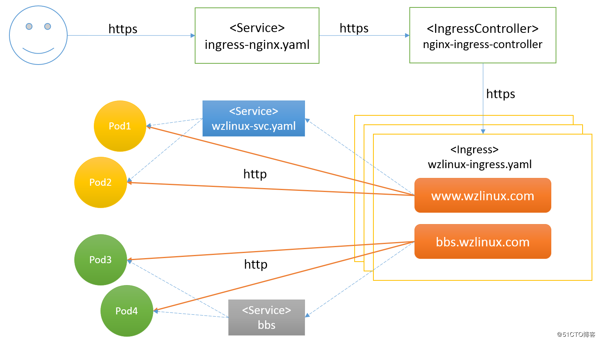

# ingress-nginx 应用
Ingress是从Kubernetes集群外部访问集群内部服务的入口,可以简单的理解成k8s内部的nginx,用作负载均衡器.
官方文档说明:
https://kubernetes.io/docs/concepts/services-networking/ingress/

其包含两个组件Ingress Controller和Ingress:
- Ingress
将Nginx的配置抽象成一个Ingress对象,每添加一个新的服务只需写一个新的Ingress的yaml文件即可

- Ingress Controller
将新加入的Ingress转化成Nginx的配置文件并使之生效,包含Contour,F5,HAProxy,Istio,Kong,Nginx,Traefik,官方推荐我们使用Nginx




## 查看 ingress 的定义方式

```bash
kubectl explain ingress
```
## nginx-ingress 安装配置

官网：https://github.com/kubernetes/ingress-nginx
### 手工安装

相关的yaml文件:
https://github.com/kubernetes/ingress-nginx/tree/master/deploy/static

#### mandatory.yaml

配置部署的主文件也是以下各yaml文件的合集.

### namespace.yaml

创建1个独立的namespace
```bash
wget https://raw.githubusercontent.com/kubernetes/ingress-nginx/master/deploy/static/namespace.yaml
# 一般不需要修改
kubectl apply -f namespace.yaml
```
### configmap.yaml

存储通用的配置变量的,类似于配置文件,用户可以将分布式系统中用于不同模块的环境变量统一到一个对象中管理,而它与配置文件的区别在于它是存在集群的"环境"中的,并且支持K8S集群中所有通用的操作调用方式.

从数据角度来看,ConfigMap的类型只是键值组,用于存储被Pod或者其他资源对象(如RC)访问的信息.这与secret的设计理念有异曲同工之妙,主要区别在于ConfigMap通常不用于存储敏感信息,而只存储简单的文本信息.

ConfigMap可以保存环境变量的属性，也可以保存配置文件.创建pod时,对configmap进行绑定,pod内的应用可以直接引用ConfigMap的配置.相当于configmap为应用/运行环境封装配置.

pod使用ConfigMap,通常用于:设置环境变量的值、设置命令行参数、创建配置文件.
```bash
wget https://raw.githubusercontent.com/kubernetes/ingress-nginx/master/deploy/configmap.yaml \
-O configmap.yaml
kubectl apply -f configmap.yaml
# 一般不需要修改
```
### rbac.yaml

 负责Ingress的RBAC授权的控制,其创建了Ingress用到的ServiceAccount,ClusterRole,Role,RoleBinding,ClusterRoleBinding

```bash
wget https://raw.githubusercontent.com/kubernetes/ingress-nginx/master/deploy/rbac.yaml \
-O rbac.yaml
kubectl apply -f rbac.yaml
# 不需要修改
```
### with-rbac.yaml

创建ingress-controller,ingress-controller的作用是将新加入的Ingress进行转化为Nginx的配置.
Ingress-Controller以Pod的形式运行,监控apiserver的/ingress接口后端的backend services,如果service发生变化,则Ingress-Controller自动更新转发规则.
基本逻辑如下：
- 监听apiserver,获取全部ingress定义
- 基于ingress定义,生成nginx的配置文件/etc/nginx/nginx.conf
- 执行nginx -s reload,重新加载nginx.conf配置文件的内容

```bash
wget https://raw.githubusercontent.com/kubernetes/ingress-nginx/master/deploy/with-rbac.yaml \
-O with-rbac.yaml
cp with-rbac.yaml{,.orig}
# 打标签指定edgenode 节点
# kubectl label nodes k8s-node2 edgenode=true
# kubectl label nodes k8s-node1 edgenode=true
cat > /tmp/temp_file.yaml <<EOF
      affinity:
        nodeAffinity:
          requiredDuringSchedulingIgnoredDuringExecution:
            nodeSelectorTerms:
            - matchExpressions:
              - key: ${edgenode_label:?}
                operator: In
                values:
                - "true"
EOF
sed -i '/nginx-ingress-serviceaccount/r /tmp/temp_file.yaml' with-rbac.yaml
rm -rf /tmp/temp_file.yaml
sed -i "s@replicas: 1@replicas: ${edgenode_counts:?}@1" with-rbac.yaml
kubectl apply -f with-rbac.yaml
```
### ingress-nginx provider

```bash
cat > service-ingress-nginx.yaml <<EOF
apiVersion: v1
kind: Service
metadata:
  name: ingress-nginx
  namespace: ingress-nginx
  labels:
    app.kubernetes.io/name: ingress-nginx
    app.kubernetes.io/part-of: ingress-nginx
spec:
 type: LoadBalancer
 externalIPs:
   - ${egenode_vip:?}
 externalTrafficPolicy: Local
 healthCheckNodePort: 0
 ports:
    - name: http
      port: 80
      targetPort: 80
      protocol: TCP
    - name: https
      port: 443
      targetPort: 443
      protocol: TCP
 selector:
    app.kubernetes.io/name: ingress-nginx
    app.kubernetes.io/part-of: ingress-nginx

---
EOF
kubectl apply -f service-ingress-nginx.yaml
# 采用kube-proxy IPVS 实现vip 访问
```
==注意事项：==对于使用了externalIPs的Service,如ingress-controller,当开启IPVS后,externalIP也会作为VIP被ipvs接管,因此如果在externalIp指定了Kubernetes集群中的具体Node节点的IP，在重启kube-proxy之前需要提前将externalIp替换成预先规划好的VIP，否则会出现VIP和Node节点IP冲突的问题。
## 部署后端服务

```bash
# 查看ingress的配置清单选项
 kubectl explain ingress.spec
```
### tomcat

```bash
# 部署tomcat server 和ingress-tomcat.yaml
cat > tomcat-demo.yaml <<EOF
apiVersion:              v1
kind:                    Service
metadata:
  name:                  tomcat
  namespace:             default
spec:
  selector:
    app:                 tomcat
    release:             canary
  ports:
  - name:                http
    targetPort:          8080
    port:                8080
  - name:                ajp
    targetPort:          8009
    port:                8009
---
apiVersion:              apps/v1
kind:                    Deployment
metadata:
  name:                  tomcat-deploy
  namespace:             default
spec:
  replicas:              3
  selector:
    matchLabels:
      app:               tomcat
      release:           canary
  template:
    metadata:
      labels:
        app:             tomcat
        release:         canary
    spec:
      containers:
      - name:            tomcat
        image:           tomcat:8.5.37-jre8-alpine
        #此镜像在dockerhub上进行下载，需要查看版本是否有变化，hub.docker.com
        ports:
        - name:          http
          containerPort: 8080
          name:          ajp
          containerPort: 8009
EOF

cat > ingress-tomcat.yaml <<EOF
apiVersion: extensions/v1beta1
kind: Ingress
metadata:
  name: tomcat
  namespace: default
  annotations:
    kubernetes.io/ingress.class: "nginx"
    nginx.ingress.kubernetes.io/rewrite-target: /
spec:
  rules:
  - host: ak47.k8s.com # 必须为域名
    http:
      paths:
      - path: /tomcat
        backend:
          serviceName: tomcat
          servicePort: 8080
EOF

kubectl get ingress
kubectl describe ingress

```
访问url
http://ak47.k8s.com/tomcat
### 支持https

```bash
deploy-tomcat-tls.sh
```
## ingress types
### single service ingress

```yaml
apiVersion: extensions/v1beta1
kind: Ingress
metadata:
  name: test-ingress
spec:
  backend:
    serviceName: testsvc
    servicePort: 80
```
这种情况下,所有到该ingress的流量(/后的所有http请求),都会转到testsvc:80
### Simple fanout

fanout是个很有意思的词.简单理解就是这种ingress会将用户的请求根据路径fanout到多个Real Server去.例如下例,发给foo.bar.com的请求会根据url进行路由.

```
foo.bar.com -> 178.91.123.132 -> / foo    s1:80
                                 / bar    s2:80

```
编排文件如下:
```yaml
apiVersion: extensions/v1beta1
kind: Ingress
metadata:
  name: test
  annotations:
    nginx.ingress.kubernetes.io/rewrite-target: /
spec:
  rules:
  - host: foo.bar.com
    http:
      paths:
      - path: /foo
        backend:
          serviceName: s1
          servicePort: 80
      - path: /bar
        backend:
          serviceName: s2
          servicePort: 80
```
==注意！==如果ingress中没有指定hosts,也可以用IP地址来访问,但ingress-nginx默认要求https,所以这时会遇到访问总是308跳转的问题.

例如下面这个ingress
```yaml
apiVersion: extensions/v1beta1
kind: Ingress
metadata:
  name: mini-ingress
  annotations:
    nginx.ingress.kubernetes.io/rewrite-target: /
    kubernetes.io/ingress.class: "nginx"
    nginx.ingress.kubernetes.io/ssl-redirect: "false"
spec:
  rules:
  - http:
      paths:
      - path: /mini
        backend:
          serviceName: nginx
          servicePort: 80
```
访问/mini路径时,总是返回308重定向
此时的nginx.conf对应的配置如下，可以看到，如果redirect_to_https，则会跳转到https。

                location ~* ^/mini\/?(?<baseuri>.*) {
                        # enforce ssl on server side
                        if ($redirect_to_https) {
                                return 308 https://$best_http_host$request_uri;
                        }
在[issues/1567](https://github.com/kubernetes/ingress-nginx/issues/1567)给了一个比较好的办法:指定 nginx.ingress.kubernetes.io/ssl-redirect为false,也就是不要对http强制跳转

### Name based virtual hosting

nginx可以根据用户请求的hosts,来转发到对应的Real Server.如下图.注意IP地址,端口号都是不变的.
```
foo.bar.com --|                 |-> foo.bar.com s1:80
              | 178.91.123.132  |
bar.foo.com --|                 |-> bar.foo.com s2:80

```
编排文件
```yaml
apiVersion: extensions/v1beta1
kind: Ingress
metadata:
  name: test
spec:
  rules:
  - host: foo.bar.com
    http:
      paths:
      - backend:
          serviceName: s1
          servicePort: 80
  - host: bar.foo.com
    http:
      paths:
      - backend:
          serviceName: s2
          servicePort: 80
```
### Multiple ingress controllers

某些情况下我们可能希望区分不同的ingress(例如不同区域,不同配置,不同环境),此时k8s集群上会有多个ingress controller,创建Ingress时,需要指定希望哪个controller来处理该请求
不同的ingress controller,通过ingress-class来区分
==参考:==
https://kubernetes.github.io/ingress-nginx/user-guide/multiple-ingress/

创建ingress时,指定不同的ingress-class

```yaml
metadata:
  name: foo
  annotations:
    kubernetes.io/ingress.class: "gce"
metadata:
  name: foo
  annotations:
    kubernetes.io/ingress.class: "nginx"
```

## 升级
### Without Helm

```bash
kubectl set image deployment/nginx-ingress-controller \
  nginx-ingress-controller=quay.io/kubernetes-ingress-controller/nginx-ingress-controller:0.22.0 -n ingress-nginx
# or
kubectl edit deployment nginx-ingress-controller -n ingress-nginx
```
### With Helm
If you installed ingress-nginx using the Helm command in the deployment docs so its name is ngx-ingress,you should be able to upgrade using
```bash
helm upgrade --reuse-values nginx-ingress stable/nginx-ingress
```
##  参考

- https://stackoverflow.com/questions/49845021/getting-an-kubernetes-ingress-endpoint-ip-address
