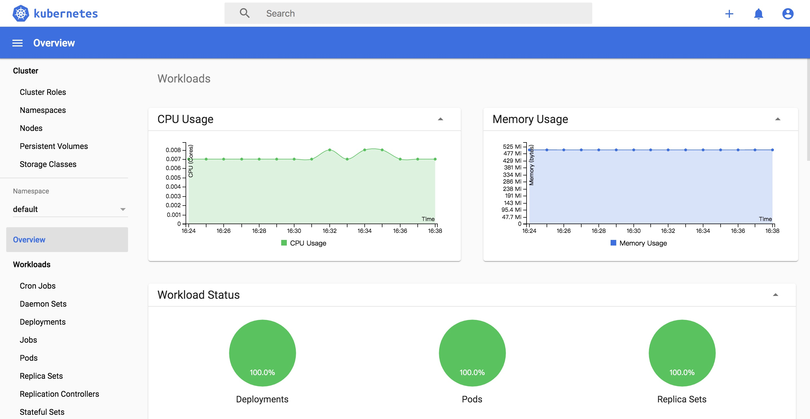

# 10.01.部署dashboard插件

github:https://github.com/kubernetes/dashboard

## 准备

### 拉取相关images
脚本: addons/dashbaord/images/2.0

### 生成ingress nginx 证书
脚本:ingress/nginx-ingress/ingress-csr/gen-ingress-csr.sh
- hosts 字段为需要使用ingress nginx 的域名

## 安装部署

### 手工部署
手工安装最新2.0.0-beta2版本。
脚本:10.01.dashboard-install.sh
```bash
source /opt/k8s/bin/environment.sh
[ ! -d /opt/k8s/addons ] && mkdir -p /opt/k8s/addons
[ -d /opt/k8s/addons/dashboard/manual ] && rm -rf /opt/k8s/addons/dashboard/manual
mkdir -p /opt/k8s/addons/dashboard/manual
cd /opt/k8s/addons/dashboard/manual || exit
dashboard_version=2.0.0-beta2
info "dashboard-$dashboard_version install ...."
# Before installing the new beta, remove the previous version by deleting its namespace
kubectl delete ns kubernetes-dashboard
src_url="https://raw.githubusercontent.com/kubernetes/dashboard/v$dashboard_version/aio/deploy/recommended.yaml"
wget $src_url -O kubernetes-dashboard.yaml
cp kubernetes-dashboard.yaml{,.orig}
sed -i "s@replicas: 1@replicas: 2@1" kubernetes-dashboard.yaml
kubectl create -f kubernetes-dashboard.yaml
```
#### 创建dashboard-secret 和dashboard-ingress
脚本:
addons/dashboard/manual/ingress/gen-dashboard-secret.sh
```bash
info "create k8s-dashboard-secret ..... "
cd /opt/k8s/certs/ingress-nginx || exit
kubectl create secret generic k8s-dashboard-secret \
--from-file=tls.key=ingress-nginx-key.pem \
--from-file=tls.crt=ingress-nginx.pem -n kubernetes-dashboard --dry-run -o yaml | kubectl apply -f -
```
脚本:addons/dashboard/manual/ingress/gen-dashboard-ingress.sh
```bash
source /opt/k8s/bin/environment.sh
export dashboard_host="dashboard.ak47.com"
cd /opt/k8s/addons/dashboard/manual || exit
mkdir -p ingress
cd ingress || exit
info "create dashboard ingress  ..... "
# Secure backends DEPRECATED (since 0.18.0)
# nginx.ingress.kubernetes.io/secure-backends: "true" 已经被废弃
#
cat > ingress-dashboard-tls.yaml <<EOF
apiVersion: extensions/v1beta1
kind: Ingress
metadata:
  name: dashboard-ingress
  namespace: kubernetes-dashboard
  annotations:
    kubernetes.io/ingress.class: "nginx"
    nginx.ingress.kubernetes.io/ssl-redirect: "true"
    nginx.ingress.kubernetes.io/ssl-passthrough: "true"
    nginx.ingress.kubernetes.io/backend-protocol: "HTTPS"

spec:
  tls:
  - secretName: k8s-dashboard-secret
    hosts:
    - $dashboard_host

  rules:
  - host: $dashboard_host
    http:
      paths:
      - path: /
        backend:
          serviceName: kubernetes-dashboard
          servicePort: 443
EOF
kubectl apply -f ingress-dashboard-tls.yaml
```
- dashboard.ak47.com 为访问dashboard的域名

### helm 安装
脚本:addons/dashbaord/chart/install-dashboard.sh

## 登录Dashboard的token和kubeconfig配置文件

### 创建管理员用户

创建一个管理员用户,并绑定cluster-admin角色。
脚本:10.01.dashboard-install.sh
```bash
nfo "create user (name:admin) ...."
cat > dashboard-admin-user.yaml <<EOF
apiVersion: v1
kind: ServiceAccount
metadata:
  labels:
    k8s-app: kubernetes-dashboard
  name: admin
  namespace: kubernetes-dashboard
---
apiVersion: rbac.authorization.k8s.io/v1
kind: ClusterRoleBinding
metadata:
  name: admin
roleRef:
  apiGroup: rbac.authorization.k8s.io
  kind: ClusterRole
  name: cluster-admin
subjects:
- kind: ServiceAccount
  name: admin
  namespace: kubernetes-dashboard
EOF
kubectl create -f dashboard-admin-user.yaml
# 查看是否创建成功 （创建用户为 admin）
kubectl get sa --all-namespaces
kubectl get clusterrolebindings  --all-namespaces
# 删除账号
kubectl delete sa/dashboard --namespace kubernetes-dashboard
kubectl delete clusterrolebindings/dashboard --namespace kubernetes-dashboard
```
### 获取管理员用户的Token
脚本:addons/dashboard/get-token.sh
```bash
kubectl -n kubernetes-dashboard describe secret $(kubectl -n kubernetes-dashboard get secret | grep admin-token | awk '{print $1}')
```
根据获得的token登录系统
### 创建使用token的KubeConfig文件
脚本:addons/dashbaord/get-kubeconfig.sh
```bash
source /opt/k8s/bin/environment.sh
[ ! -d /opt/k8s/addons ] && mkdir -p /opt/k8s/addons
cd /opt/k8s/addons/dashboard || exit
info "generate kubeconfig file"
ADMIN_SECRET=$(kubectl get secrets -n kubernetes-dashboard | grep admin | awk '{print $1}')
DASHBOARD_LOGIN_TOKEN=$(kubectl describe secret -n kubernetes-dashboard ${ADMIN_SECRET} | grep -E '^token' | awk '{print $2}')
echo ${DASHBOARD_LOGIN_TOKEN}

# 设置集群参数
kubectl config set-cluster kubernetes \
  --certificate-authority=/etc/kubernetes/cert/ca.pem \
  --embed-certs=true \
  --server=${KUBE_APISERVER} \
  --kubeconfig=dashboard.kubeconfig

# 设置客户端认证参数，使用上面创建的 Token
kubectl config set-credentials dashboard_user \
  --token=${DASHBOARD_LOGIN_TOKEN} \
  --kubeconfig=dashboard.kubeconfig

# 设置上下文参数
kubectl config set-context default \
  --cluster=kubernetes \
  --user=dashboard_user \
  --kubeconfig=dashboard.kubeconfig

# 设置默认上下文
kubectl config use-context default --kubeconfig=dashboard.kubeconfig

```
- 用生成的dashboard.kubeconfig登录Dashboard
## 访问dashboard
https://dashbaord.ak47.com


为了集群安全,从1.7开始,dashboard只允许通过 https访,如果使用kube proxy则必须监听 localhos或127.0.0.1,对于 NodePort没有这个限制,但是仅建议在开发环境中使用.对于不满足这些条件的登录访问，在登录成功后浏览器不跳转，始终停在登录界面。
参考:https://github.com/kubernetes/dashboard/wiki/Accessing-Dashboard---1.7.X-and-above https://github.com/kubernetes/dashboard/issues/2540

三种访问方法
- kubernetes-dashboard服务暴露了NodePort,可以使用https://NodeIP:NodePort 地址访问 dashboard
- 通过 kube-apiserver 访问 dashboard
- 通过 kubectl proxy 访问 dashboard
## 检查

```bash
# 查看pod
kubectl get pods -n kubernetes-dashboard
# dashboard info
kubectl describe svc kubernetes-dashboard -n kubernetes-dashboard
# where is node run dashboard
kubectl get svc,pod --all-namespaces | grep dashboard
kubectl  get pods -n kubernetes-dashboard -o wide
```

### 访问dashboard
为了集群安全,从1.7开始,dashboard只允许通过 https访,如果使用kube proxy则必须监听 localhos或127.0.0.1,对于 NodePort没有这个限制,但是仅建议在开发环境中使用.对于不满足这些条件的登录访问，在登录成功后浏览器不跳转，始终停在登录界面。
参考:https://github.com/kubernetes/dashboard/wiki/Accessing-Dashboard---1.7.X-and-above https://github.com/kubernetes/dashboard/issues/2540

三种访问方法
- kubernetes-dashboard服务暴露了NodePort,可以使用https://NodeIP:NodePort 地址访问 dashboard
- 通过 kube-apiserver 访问 dashboard
- 通过 kubectl proxy 访问 dashboard

#### kube-apiserver访问dashboard

```bash
# 获取集群服务地址列表
kubectl cluster-info
```
必须通过 kube-apiserver 的安全端口(https)访问 dashbaord,访问时浏览器需要使用自定义证书,否则会被kube-apiserver拒绝访问.创建和导入自定义证书的步骤,参考:11.00.校验TLS证书.md

浏览器访问 URL:
https://10.0.1.253:8443/api/v1/namespaces/kubernetes-dashboard/services/https:kubernetes-dashboard:/proxy/
## 参考

- https://github.com/kubernetes/dashboard/wiki/Access-control
- https://github.com/kubernetes/dashboard/issues/2558
- https://kubernetes.io/docs/concepts/configuration/organize-cluster-access-kubeconfig/
