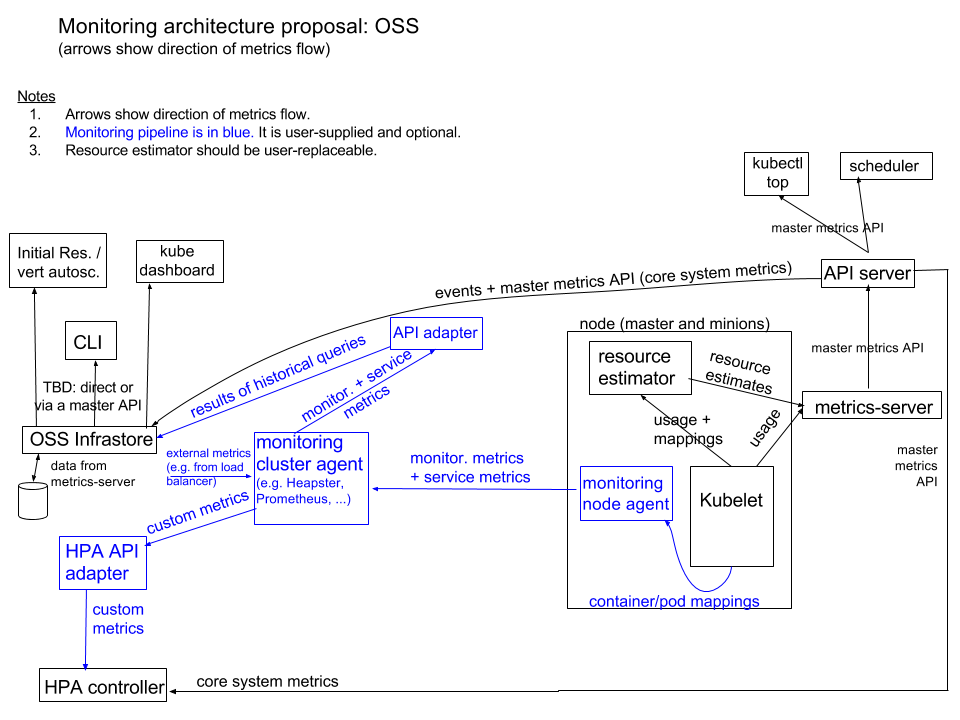

# 09-4.部署 metrics-server
home: https://github.com/kubernetes-incubator/metrics-server

  metrics-server通过kube-apiserver发现所有节点,然后调用kubelet APIs(通过 https 接口)获得各节点(Node)和Pod的CPU,Memory等资源使用情况。

从 Kubernetes 1.12 开始,kubernetes 的安装脚本移除了Heapster,从 1.13 开始完全移除了对 Heapster的支持,Heapster不再被维护
## 监控架构


## 准备

### 创建metrics-server使用的证书

脚本:cert/aggregator/get-aggregator-ca.sh

```bash
source /opt/k8s/bin/environment.sh
[ ! -d /opt/k8s/certs ] && mkdir -p /opt/k8s/certs
[ -d /opt/k8s/certs/aggregator-ca ] && rm -rf /opt/k8s/certs/aggregator-ca
mkdir -p /opt/k8s/certs/aggregator-ca
cd /opt/k8s/certs/aggregator-ca || exit

info "create aggregator-ca-csr.json ..... "
cat > aggregator-ca-csr.json <<EOF
{
  "CN": "aggregator",
  "hosts": [],
  "key": {
    "algo": "rsa",
    "size": 2048
  },
  "names": [
    {
      "C": "CN",
      "ST": "Beijing",
      "L": "Beijing",
      "O": "ANSHI",
      "OU": "k8s"
    }
  ]
}
EOF
info "create self-signed root CA certificate and private key ..... "
cfssl gencert -initca aggregator-ca-csr.json | cfssljson -bare aggregator-ca -
cp /opt/k8s/certs/CA/ca-config.json aggregator-ca-config.json
info "check certificate ....."
openssl x509  -noout -text -in  aggregator-ca.pem

```
- ==注意:==CN名称为aggregator,需要与kube-apiserver的--requestheader-allowed-names参数配置一致

将生成的证书和私钥文件拷贝到 kube-apiserver 节点

```bash
info "deploy aggregator-ca to all master nodes"
source /opt/k8s/bin/environment.sh
for node_ip in "${MASTER_IPS[@]}"
  do
    echo ">>> ${node_ip}"
    ssh ${k8s_user:?}@${node_ip} "sudo mkdir -p /etc/kubernetes/cert && sudo chown -R $k8s_user /etc/kubernetes"
    scp /opt/k8s/certs/aggregator-ca/aggregator-ca*.pem $k8s_user@${node_ip}:/etc/kubernetes/cert
    scp /opt/k8s/certs/aggregator-ca/aggregator-ca-config.json $k8s_user@${node_ip}:/etc/kubernetes/cert
  done

```
### 修改 kubernetes systemd unit以支持 metrics-server
#### kube-apiserver

```bash
# 添加如下参数
--requestheader-allowed-names="aggregator" \\
--requestheader-client-ca-file=/etc/kubernetes/cert/aggregator-ca.pem \\
--requestheader-extra-headers-prefix="X-Remote-Extra-" \\
--requestheader-group-headers=X-Remote-Group \\
--requestheader-username-headers=X-Remote-User \\
--proxy-client-cert-file=/etc/kubernetes/cert/aggregator.pem \\
--proxy-client-key-file=/etc/kubernetes/cert/aggregator-key.pem \\
```
-  \--requestheader-*：kube-apiserver的aggregator layer 相关的配置参数,proxy-client&HPA需要使用
-  \--requestheader-client-ca-file:用于签名--proxy-client-cert-file和--proxy-client-key-file指定的证书,在启用了 metric aggregator时使用
-  \--proxy-client-*:apiserver访问metrics-server使用的证书
-  \如果--requestheader-allowed-names不为空，则--proxy-client-cert-file 证书的CN必须位于 allowed-names中,默认为aggregator

如果kube-apiserver机器没有运行kube-proxy,则还需要添加--enable-aggregator-routing=true 参数

关于--requestheader-XXX相关参数,参考:

- https://github.com/kubernetes-incubator/apiserver-builder/blob/master/docs/concepts/auth.md
- https://docs.bitnami.com/kubernetes/how-to/configure-autoscaling-custom-metrics/

注意:requestheader-client-ca-file指定的 CA 证书,必须具有client auth and server auth

#### kube-controllr-manager

添加如下配置参数：
```bash
--requestheader-allowed-names="" \\
--requestheader-client-ca-file=/etc/kubernetes/cert/aggregator-ca.pem \\
--requestheader-extra-headers-prefix="X-Remote-Extra-" \\
--requestheader-group-headers=X-Remote-Group \\
--requestheader-username-headers=X-Remote-User \\
```
用于配置HPA控制器使用REST客户端获取metrics数据

## 手工安装

有两个项目提供了metrics-server：
- github.com/kubernetes-incubator/metrics-server
- github.com/kubernetes/kubernetes 官方源码树上作为addon
### 下载
```bash
source /opt/k8s/bin/environment.sh
[ ! -d /opt/k8s/addons ] && mkdir -p /opt/k8s/addons
[ -d /opt/k8s/addons/metrics-server/manual ] && rm -rf /opt/k8s/addons/metrics-server/manual
mkdir -p /opt/k8s/addons/metrics-server/manual
cd /opt/k8s/addons/metrics-server/manual || exit
git clone https://github.com/kubernetes-incubator/metrics-server.git
```

### 修改插件配置文件并安装

```bash
cd metrics-server/deploy/1.8+/ ||exit
cp metrics-server-deployment.yaml{,.orig}
cat > /tmp/temp_file.yaml <<EOF
        command:
            - /metrics-server
            - --logtostderr
            - --metric-resolution=30s
            - --kubelet-preferred-address-types=InternalIP,Hostname,InternalDNS,ExternalDNS,ExternalIP
EOF
sed -i '/imagePullPolicy: Always/r /tmp/temp_file.yaml' metrics-server-deployment.yaml
rm -rf /tmp/temp_file.yaml
cp resource-reader.yaml{,.orig}
sed -i '/  - pods/a\  - pods/stats' resource-reader.yaml
# 授予kube-system:metrics-server ServiceAccount访问kubelet API的权限
info "create auth-kubelet.yaml ....."
cat > auth-kubelet.yaml <<EOF
apiVersion: rbac.authorization.k8s.io/v1
kind: ClusterRoleBinding
metadata:
  name: metrics-server:system:kubelet-api-admin
  labels:
    kubernetes.io/cluster-service: "true"
    addonmanager.kubernetes.io/mode: Reconcile
roleRef:
  apiGroup: rbac.authorization.k8s.io
  kind: ClusterRole
  name: system:kubelet-api-admin
subjects:
- kind: ServiceAccount
  name: metrics-server
  namespace: kube-system
EOF
info "metrics-server install ..... "
kubectl create -f ./
```
## helm 安装
脚本:addons/metrics-server/chart/install-metrics-server.sh

## 检查

### 查看运行情况


```bash
kubectl get pods -n kube-system |grep metrics-server
```
### 验证metrics-server


```bash
# 查看api version
kubectl api-versions |grep metrics
```
### 查看Metrics API数据

方法1
```bash
#启动一个代理以便curl api
kubectl proxy --port=8091
# Starting to serve on 127.0.0.1:8091
#直接查看接口数据：
#可获取的资源：nodes和pods
curl localhost:8091/apis/metrics.k8s.io/v1beta1
# 返回结果如下:
{
  "kind": "APIResourceList",
  "apiVersion": "v1",
  "groupVersion": "metrics.k8s.io/v1beta1",
  "resources": [
    {
      "name": "nodes",
      "singularName": "",
      "namespaced": false,
      "kind": "NodeMetrics",
      "verbs": [
        "get",
        "list"
      ]
    },
    {
      "name": "pods",
      "singularName": "",
      "namespaced": true,
      "kind": "PodMetrics",
      "verbs": [
        "get",
        "list"
      ]
    }
  ]
}%

# 查看获取到的Node资源指标数据:cpu和内存
curl localhost:8091/apis/metrics.k8s.io/v1beta1/nodes
kubectl top node
```
-  内存单位 Mi=1024\*1024字节  M=1000*1000字节
-  CPU单位 1核=1000m 即250m=1/4核

方法2:直接使用kubectl命令访问
```bash
kubectl get --raw "/apis/metrics.k8s.io/v1beta1" | jq .
kubectl get --raw "/apis/metrics.k8s.io/v1beta1/nodes" | jq .
kubectl get --raw "/apis/metrics.k8s.io/v1beta1/pods" | jq .
```
方法3:通过kube-apiserver访问

```bash
kubectl cluster-info
# Metrics-server is running at https://10.0.1.253:8443/api/v1/namespaces/kube-system/services/https:metrics-server:/proxy

https://10.0.1.253:8443/apis/metrics.k8s.io/v1beta1/nodes
https://10.0.1.253:8443/apis/metrics.k8s.io/v1beta1/nodes/k8s-node1
https://10.0.1.253:8443/apis/metrics.k8s.io/v1beta1/pods
https://10.0.1.253:8443/apis/metrics.k8s.io/v1beta1/namespaces/default/pods

```
## 参考
https://kubernetes.feisky.xyz/zh/addons/metrics.html
metrics-server RBAC
https://github.com/kubernetes-incubator/metrics-server/issues/40
metrics-server 参数
https://github.com/kubernetes-incubator/metrics-server/issues/25
https://kubernetes.io/docs/tasks/debug-application-cluster/core-metrics-pipeline/
