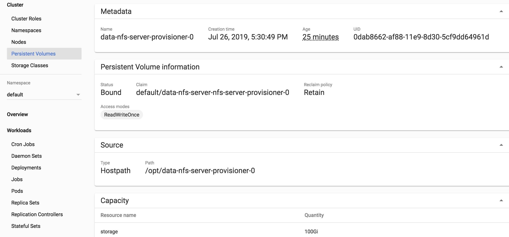
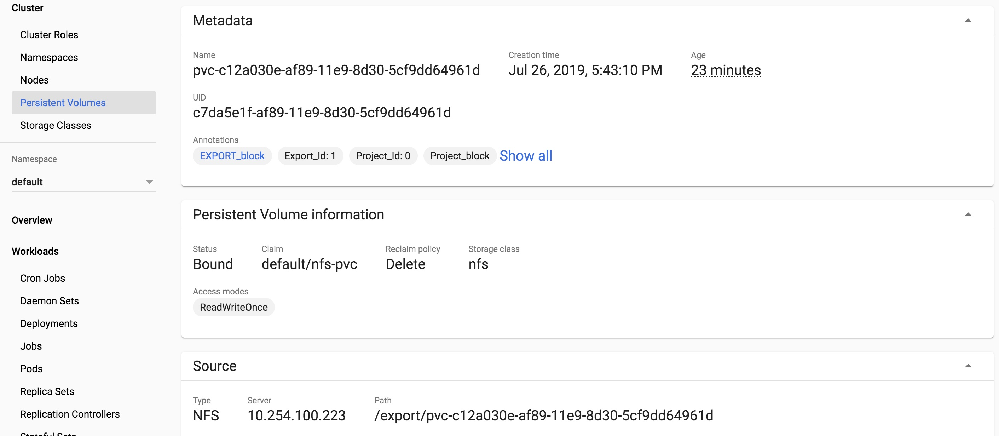
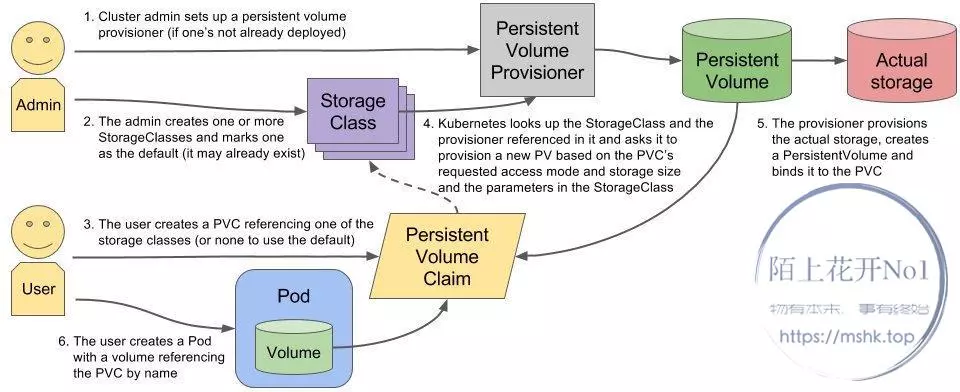

# 11.01.NFS服务

NFS是一个网络文件系统,可以将存储服务器的磁盘共享到集群范围内使用.NFS使用简单,性能也还不错,是快速自建集群存储的首选方案,而且通过Kubernetes的PV/PVC等接口,以后还可以容易地迁移到新的存储系统.

## 操作系统部署NFS服务
### 服务端配置
脚本:nfs/centos/nfs-server-init.sh

```bash
source /opt/k8s/bin/environment.sh
info "configure NFS server"
echo ">>> ${nfs_server_name:?}"
# 设置 NFS 服务开机启动
ssh ${k8s_user:?}@${nfs_server_ip:?} "sudo yum install nfs-utils -y \
&&sudo systemctl enable rpcbind&&sudo systemctl enable nfs"
# 启动 NFS 服务
ssh ${k8s_user:?}@${nfs_server_ip:?} "sudo systemctl start rpcbind \
&&sudo systemctl start nfs"
# 防火墙需要打开 rpc-bind 和 nfs 的服务
# ssh ${k8s_user:?}@${nfs_server_ip:?} "sudo firewall-cmd --zone=public --permanent \
# --add-service=rpc-bind"
# ssh ${k8s_user:?}@${nfs_server_ip:?} "sudo firewall-cmd --zone=public --permanent \
# --add-service=mountd"
# ssh ${k8s_user:?}@${nfs_server_ip:?} "sudo firewall-cmd --zone=public --permanent --add-service=nfs&&sudo firewall-cmd --reload"
# 在服务端配置一个共享目录
ssh ${k8s_user:?}@${nfs_server_ip:?} "[ -f ${nfs_data:?} ] && sudo rm -rf ${nfs_data:?}"
ssh ${k8s_user:?}@${nfs_server_ip:?} "sudo mkdir -p ${nfs_data:?} && sudo chmod 755 ${nfs_data:?}"
echo "${nfs_data:?}     ${nfs_ips:?}(rw,sync,no_root_squash,no_all_squash)" >exports
ssh ${k8s_user:?}@${nfs_server_ip:?} "[ -f /etc/exports ] &&sudo rm -rf /etc/exports"
scp exports ${k8s_user:?}@${nfs_server_ip:?}:/opt/k8s/
ssh ${k8s_user:?}@${nfs_server_ip:?} "sudo mv /opt/k8s/exports /etc/"
ssh ${k8s_user:?}@${nfs_server_ip:?} "sudo systemctl restart nfs && sudo showmount -e localhost"
rm -rf exports
```
- ${nfs_data:?}: 共享目录位置
- ${nfs_ips:?}:允许其访问的NFS服务器的客户端地址，可以是客户端IP地址，也可以是一个网段(10.0.1.0/24),* 表示无限制.
- rw: 权限设置，可读可写
- sync: 同步共享目录
- no_root_squash: 可以使用 root 授权
- no_all_squash: 可以使用普通用户授权

### 客户端配置
脚本:nfs/centos/nfs-client-init.sh

```bash
source /opt/k8s/bin/environment.sh
info "configure NFS client"
for node_ip in "${NFS_CLIENT_IPS[@]}"
do
        echo ">>> ${node_ip}"
        ssh ${k8s_user:?}@$node_ip "sudo yum install nfs-utils -y \
            &&sudo systemctl enable rpcbind"
        ssh ${k8s_user:?}@$node_ip "sudo mkdir -p ${nfs_data:?}"
        ssh ${k8s_user:?}@$node_ip "sudo umount ${nfs_data:?}"
        ssh ${k8s_user:?}@$node_ip "sudo mount -t nfs ${nfs_server_ip:?}:${nfs_data:?} ${nfs_data}"
        # 查看mount结果
        ssh ${k8s_user:?}@$node_ip  "mount |grep ${nfs_data:?}"
done
```

## kubernetes中 NFS服务的几种使用方式
### nfs作为volume

nfs可以直接作为存储卷使用,下面是一个redis部署的YAML配置文件.在此示例中,redis在容器中的持久化数据保存在/nfs_data目录下,存储卷使用nfs,nfs的服务地址为:10.0.1.28,存储路径为：/nfs_data/redis/data.容器通过volumeMounts.name的值确定所使用的存储卷.

```yaml
apiVersion: apps/v1 # for versions before 1.9.0 use apps/v1beta2
kind: Deployment
metadata:
  name: redis
spec:
  selector:
    matchLabels:
      app: redis
  revisionHistoryLimit: 2
  template:
    metadata:
      labels:
        app: redis
    spec:
      containers:
      # 应用的镜像
      - image: redis
        name: redis
        imagePullPolicy: IfNotPresent
        # 应用的内部端口
        ports:
        - containerPort: 6379
          name: redis6379
        env:
        - name: ALLOW_EMPTY_PASSWORD
          value: "yes"
        - name: REDIS_PASSWORD
          value: "redis"
        # 持久化挂接位置，在docker中
        volumeMounts:
        - name: redis-persistent-storage
          mountPath: /nfs_data
      volumes:
      # 宿主机上的目录
      - name: redis-persistent-storage
        nfs:
          path: /nfs_data/redis/data
          server: 10.0.1.28
```
### nfs作为 PersistentVolume

创建类型为nfs的持久化存储卷,用于为PersistentVolumClaim提供存储卷.在下面的PersistenVolume YAML配置文件中.定义了一个名为nfs-pv的持久化存储卷,此存储卷提供了5G的存储空间,只能由一个PersistentVolumClaim进行可读可写操作.此持久化存储卷使用的nfs服务器地址为10.0.1.28,存储的路径为/tmp。

```yaml
apiVersion: v1
kind: PersistentVolume
metadata:
  name: nfs-pv
spec:
  capacity:
    storage: 5Gi
  volumeMode: Filesystem
  accessModes:
  - ReadWriteOnce
  persistentVolumeReclaimPolicy: Recycle
  storageClassName: slow
  mountOptions:
  - hard
  - nfsvers=4.1
  # 此持久化存储卷使用nfs插件
  nfs:
    # nfs共享目录为/tmp
    path: /tmp
    # nfs服务器的地址
    server: 10.0.1.28
```
创建上述持久化存储卷:
```bash
kubectl create -f {path}/nfs-pv.yaml
```
存储卷创建成功后将处于可用状态,等待PersistentVolumClaim使用.PersistentVolumClaim会通过访问模式和存储空间自动选择合适存储卷,并与其进行绑定.

### 利用NFS动态提供Kubernetes后端存储卷

使用nfs-client-provisioner这个应用,利用NFS Server给Kubernetes作为持久存储的后端,并且动态提供PV.前提条件是有已经安装好的NFS服务器,并且NFS服务器与Kubernetes的Slave节点都能网络连通.

## Kubernetes中 部署NFS集群及其使用

### NFS Server Provisioner

- Kubernetes外部的动态存储提供者,底层是通过NFS(网络文件系统)来提供的.可以通过它快速地部署一个几乎可以在任何地方使用的网络共享存储.
- 缺省情况下的安装是不支持持久化的,NFS服务的数据保存在临时目录中,关机会丢失数据,容量也有限.如果主机临时目录空间被耗光,还会导致主机奔溃.
- 需要将NFS的数据安装到持久卷(PV)中
- 在GCP云环境中,会提供StorageClass可以直接创建出PV
- 在私有环境中,可以使用HostPath创建PV,然后创建PVC,然后配置Helm参数文件进行安装

#### 创建宿主机PV和PVC
脚本:nfs/nfs-server-provisioner/datastore/nfs-data.sh
```bash
source /opt/k8s/bin/environment.sh
[ ! -d /opt/k8s/nfs ] && mkdir -p /opt/k8s/nfs
[ -d /opt/k8s/nfs/nfs-data ] && rm -rf /opt/k8s/nfs/nfs-data
mkdir -p /opt/k8s/nfs/nfs-data
cd /opt/k8s/nfs/nfs-data || exit
info "create nfs-data-pv.yaml ..... "
cat > nfs-data-pv.yaml <<EOF
apiVersion: v1
kind: PersistentVolume
metadata:
  name: data-nfs-server-provisioner-0
spec:
  capacity:
    storage: 100Gi
  accessModes:
    - ReadWriteOnce
  hostPath:
    path: /opt/data-nfs-server-provisioner-0
  claimRef:
    namespace: default
    name: data-nfs-server-nfs-server-provisioner-0
EOF
kubectl create -f nfs-data-pv.yaml
```
 - 基于HostPath创建的PV完成,可以到Dashboard查看持久卷.其中数据的保存路径为path: /opt/data-nfs-server-provisioner-0.
```bash
# 供NFS存储的PVC
cat > nfs-data-pvc.yaml <<EOF
apiVersion: v1
kind: PersistentVolumeClaim
metadata:
  name: data-nfs-server-nfs-server-provisioner-0
spec:
  storageClassName: ""
  accessModes:
  - ReadWriteOnce
  resources:
    requests:
      storage: 100Gi
EOF
kubectl create -f nfs-data-pvc.yaml

```
- 这里的pv和pvc是nfs服务所使用的,而不是nfs提供的,使用HostPath volumes的来提供
- hostPath volumes 不能在Kubernetes集群的不同节点机器间迁移,因此限制了 nfs-server-provisioner pod只能运行在单个node上.这对于生产环境的部署来说是不合适的.

#### 安装 nfs-server-provisioner
脚本:nfs/nfs-server-provisioner/chart/install-nfs-server.sh

```bash
source /opt/k8s/bin/environment.sh
[ ! -d /opt/k8s/addons ] && mkdir -p /opt/k8s/addons
[ -d /opt/k8s/addons/nfs-server-provisioner ] && rm -rf /opt/k8s/addons/nfs-server-provisioner
mkdir -p /opt/k8s/addons/nfs-server-provisioner
cd /opt/k8s/addons/nfs-server-provisioner || exit
info " fetch nfs-server-provisioner chart ..... "
# helm repo update
helm fetch --untar harborrepo/nfs-server-provisioner

info "create nfs-server-provisioner-settings.yaml ..... "
cat > nfs-server-provisioner-settings.yaml <<EOF

persistence:
  enabled: true
  storageClass: ""
  accessMode: ReadWriteOnce
  size: 100Gi

storageClass:
  create: true
  defaultClass: false
  name: nfs
  reclaimPolicy: Delete

EOF

info " install nfs-server-provisioner ..... "
helm install \
  --name nfs-server \
  --namespace default \
  -f nfs-server-provisioner-settings.yaml \
  nfs-server-provisioner
```
- 安装后到Dashboard查看NFS所提供的PV、StorageClass.注意这里的PV是逻辑上的,使用了上面使用HostPath物理磁盘目录创建的PV.



#### 测试 NFS Server 服务
基于NFS的nfs-server-provisioner和PV卷部署完毕后,可以通过创建PVC和使用PVC的Pod来访问,或者直接将PV服务mount到本地目录直接读写.
##### 创建PVC
yaml:nfs/nfs-server-provisioner/test/nfs-pvc.yaml
```yaml
apiVersion: v1
kind: PersistentVolumeClaim
metadata:
  name: nfs-pvc
spec:
  storageClassName: "nfs"
  accessModes:
  - ReadWriteOnce
  resources:
    requests:
      storage: 100Mi

```
```bash
kubectl create -f nfs-pvc.yaml
```
到Dashboard中Persistent Volumes查看，将会为PVC自动创建一个PV

##### 使用PVC
yaml:nfs/nfs-server-provisioner/test/nfs-pvc-client.yaml
```yaml
# This mounts the nfs volume claim into /mnt and continuously
# overwrites /mnt/index.html with the time and hostname of the pod.
apiVersion: apps/v1beta1
kind: Deployment
metadata:
  name: busybox-deployment
spec:
  replicas: 1
#  selector:
#    name: busybox-deployment
  template:
    metadata:
      labels:
        name: busybox-deployment
    spec:
      containers:
      - image: busybox
        command:
        - sh
        - -c
        - 'while true; do date > /mnt/index.html; hostname >> /mnt/index.html; sleep $(($RANDOM % 5 + 5)); done'
        imagePullPolicy: IfNotPresent
        name: busybox
        volumeMounts:
        # name must match the volume name below
        - name: nfs
          mountPath: "/mnt"
      #
      volumes:
      - name: nfs
        persistentVolumeClaim:
          claimName: nfs-pvc
```

```bash
# 本Pod将进行一个写入文件操作
kubectl create -f nfs-pvc-client.yaml
```
##### 直接连接

k8s 中部署的 nfs-server可以从外部通过nfs-client访问,也可以mount到宿主机上去.操作如下:
```bash
sudo mount -t nfs 10.254.100.223:/export/pvc-c12a030e-af89-11e9-8d30-5cf9dd64961d /opt/nfs
```
其中 10.254.100.223:/export/pvc-c12a030e-af89-11e9-8d30-5cf9dd64961d是上面通过pvc创建的pv,可以通过dashboard的Persistent Volumes查看里面的Source内容.本地挂载目录 /opt/nfs 需要用mkdir预先创建好.

## 利用NFS client provisioner动态提供Kubernetes后端存储卷

nfs-client-provisioner是一个自动配置程序,它使用配置好的NFS Server通过持久卷声明动态配置Kubernetes持久化存储.

- PV以 ${namespace}-${pvcName}-${pvName}的命名格式提供(在NFS服务器上)
- PV回收的时候以 archieved-${namespace}-${pvcName}-${pvName}的命名格式(在NFS服务器上)

### NFS-Client-Provisioner 的工作原理

nfs-client-provisioner主要分为两部分:

- 在 NFS共享目录建立Volume
- 在 Kubernetes创建持久化存储卷PV并与Volume做关联,StorageClass负责建立PVC并且与nfs-client-provisioner通讯,建立PVC和PV的连接.此外还需要创建ServiceAccount来保障nfs-client-provisioner在Kubernetes有足够的权限运行.

nfs-client-provisioner 的工作流程图如下:


### 安装
脚本:nfs/nfs-client-provisioner/chart/install-nfs-client.sh
```bash
ource /opt/k8s/bin/environment.sh
[ ! -d /opt/k8s/addons ] && mkdir -p /opt/k8s/addons
[ -d /opt/k8s/addons/nfs-client-provisioner ] && rm -rf /opt/k8s/addons/nfs-client-provisioner
mkdir -p /opt/k8s/addons/nfs-client-provisioner
cd /opt/k8s/addons/nfs-client-provisioner || exit
info " fetch nfs-client-provisioner chart ..... "
helm repo update
helm fetch --untar harborrepo/nfs-client-provisioner

info "create nfs-client-provisioner-settings.yaml ..... "
cat > nfs-client-provisioner-settings.yaml <<EOF

nfs:
  server: ${nfs_server_ip:?}
  path: ${nfs_data:?}

EOF

info " install nfs-client-provisioner ..... "
helm install \
  --name nfs-client \
  -f nfs-client-provisioner-settings.yaml \
  nfs-client-provisioner
```
### 测试
```bash
# 创建测试pvc,pods
kubectl create -f test-claim.yaml
kubectl create -f test-pod.yaml
# 在NFS服务器上的共享目录下的卷子目录中检查创建的NFS PV卷下是否有”SUCCESS” 文件。
# 删除测试POD,pvc
kubectl delete -f test-pod.yaml
kubectl delete -f test-claim.yaml
# 在NFS服务器上的共享目录下查看NFS的PV卷回收以后是否名字以archived开头。
```
